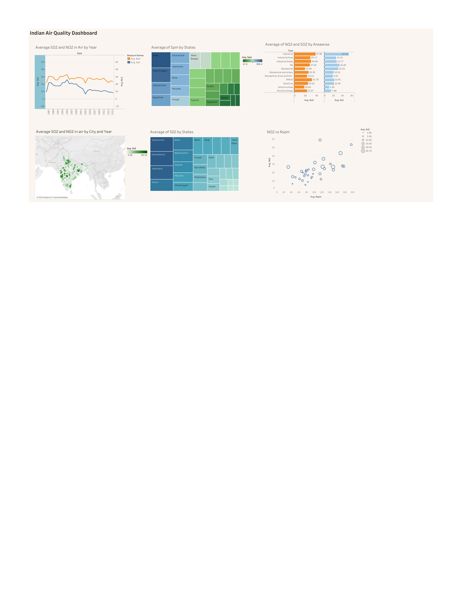

# India Air Quality Analysis — Tableau Dashboard

## 📌 Project Overview

This project focuses on analyzing air quality data across India using Tableau to explore AQI patterns, pollution trends, and geographic variations.

The analysis was developed as a data visualization project to transform air quality data into interactive and meaningful visual insights.

## 🎯 Project Objective

The objective of this project was to analyze air quality patterns across different locations in India and present the findings through an interactive Tableau dashboard.

The dashboard was designed to make it easier to identify variations in air quality and understand pollution patterns through visual analysis.

## 🛠️ Tools & Technologies

- Tableau
- Data Visualization
- Exploratory Data Analysis
- Data Analysis

## 📊 Dashboard Preview



### Full Dashboard

[View the complete Tableau Dashboard PDF](India%20Air%20Quality%20Dashboard.pdf)

## 🔍 Analysis Areas

The dashboard explores multiple dimensions of air quality through:

- Year-wise trends in average SO₂ and NO₂ levels
- State-wise comparison of average SPM levels
- State-wise comparison of average SO₂ levels
- City and year-wise geographic distribution of SO₂ and NO₂
- Area-wise comparison of NO₂ and SO₂ concentrations
- Relationship between NO₂ and RSPM levels

## 💡 Key Insights

The dashboard highlights several patterns across the available air quality data:

- Average NO₂ levels remain generally higher than SO₂ levels across much of the year-wise trend.
- Air pollutant levels vary considerably across different states and geographic locations.
- State-level visualizations reveal differences in average SPM and SO₂ concentrations.
- The city-and-year map provides a geographic view of variations in SO₂ levels across India.
- Area-wise analysis enables comparison of NO₂ and SO₂ concentrations across industrial, residential, and sensitive-area classifications.
- The NO₂ vs. RSPM scatter plot provides a visual basis for examining the relationship between these two pollutants.
  
## 📚 Skills Demonstrated

- Data Visualization
- Tableau Dashboard Development
- Exploratory Data Analysis
- Data Interpretation
- Analytical Thinking

## 📁 Repository Contents

```text
India Air Quality Dashboard.pdf
India_Air_Quality_Tableau_Dashboard_Preview.png
README.md
